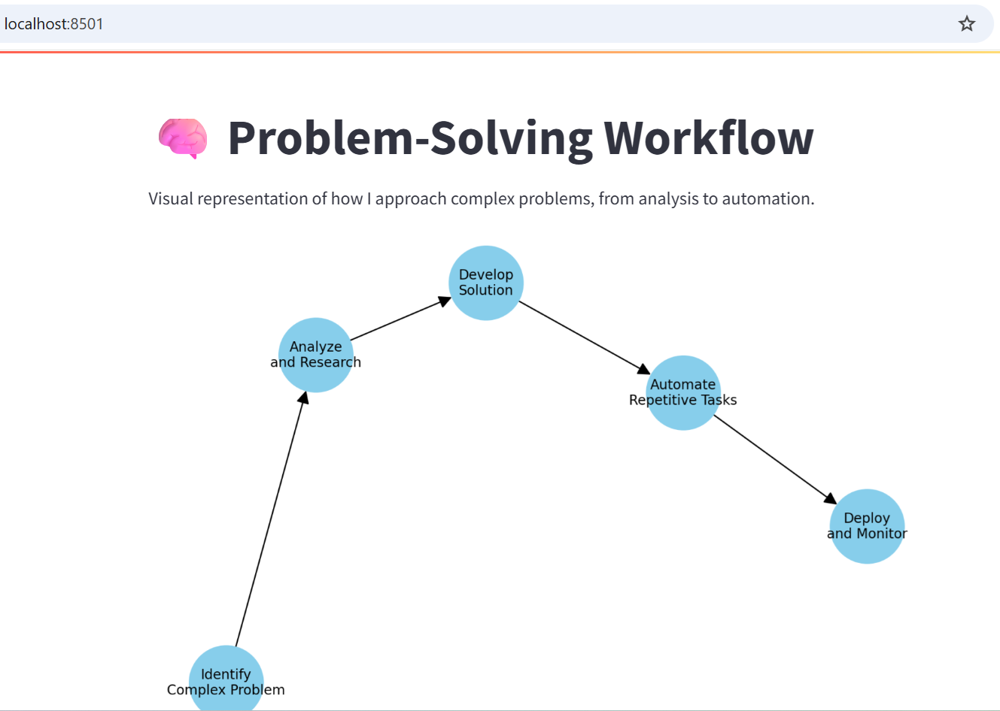

# 🧠 Problem-Solving Workflow (Streamlit App)

This is a simple Streamlit app that visualizes how I approach complex problems — from identifying issues to automating repetitive tasks.

---

## 📌 Features

- Built with Python, Streamlit, NetworkX, and Matplotlib
- Clear visual diagram of problem-solving steps
- Lightweight and easy to run locally

---

## 📸 Preview



---

## 🚀 Running Locally

```bash
# 1. Clone the repository
```bash
git clone https://github.com/tavsvards/problem-solving-workflow.git
```
```bash
cd problem-solving-workflow
```
# 2. Create and activate virtual environment
python3 -m venv venv
source venv/bin/activate

# 3. Install dependencies
pip install -r requirements.txt

# 4. Run the app
streamlit run app.py
 🧱 Dependencies
streamlit

networkx

matplotlib

You can install all with: pip install -r requirements.txt

🧠 Diagram Structure

Identify Complex Problem
        ↓
Analyze and Research
        ↓
Develop Solution
        ↓
Automate Repetitive Tasks
        ↓
Deploy and Monitor
📄 License
MIT — feel free to use, modify, and share.

Made with ❤️ by [RoSciPer (Janis)]


---

### 🔧 Ko darīt tālāk:

1. **Izveido repo:**
   ```bash
   git init
   git add .
   git commit -m "Initial commit: problem-solving diagram app"
   git remote add origin https://github.com/tavsvards/problem-solving-workflow.git
   git push -u origin main
